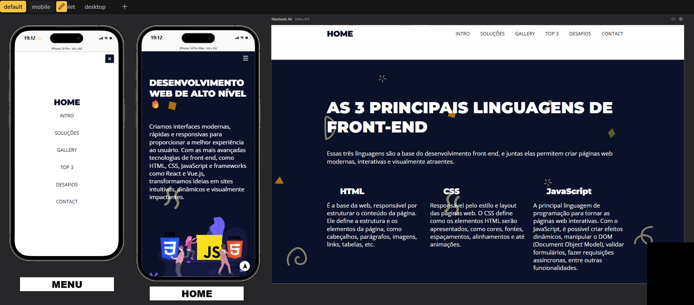

# Frontend World – Landing Page

Uma landing page moderna e responsiva criada com HTML e CSS. O objetivo do projeto foi treinar conceitos de estrutura HTML semântica, organização visual, responsividade e publicação online.

## 💻 Tecnologias utilizadas

- HTML5
- CSS3
- Design responsivo (Mobile-first)
- Google Fonts
- Deploy com Netlify

## 📷 Preview

## 🚀 Acesse o projeto

🔗 [Clique aqui para ver o site online](https://frontend-world.netlify.app/)

## 📂 Como usar

1. Clone o repositório  
2. Abra `index.html` no navegador

---

Feito com 💜 por [Bryan Miranda](https://github.com/Bryanmdev)
